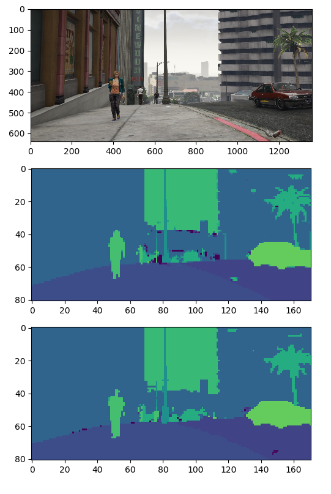

# pytorch-deeplab-resnet
[DeepLab resnet](https://arxiv.org/abs/1606.00915) model implementation in pytorch.

Rewrite of [pytorch-deeplab-resnet](https://github.com/isht7/pytorch-deeplab-resnet) to be adpated to non-square input images.

It was trained on [gta5 dataset](https://download.visinf.tu-darmstadt.de/data/from_games/) with [pretrained weight](https://drive.google.com/file/d/0BxhUwxvLPO7TVFJQU1dwbXhHdEk/view) from COCO. The trained weight for gta5 can be downloaded from [here](https://drive.google.com/open?id=1RP1ySuWxIQvRVhIexETZiIj3tMwq9_fW).

